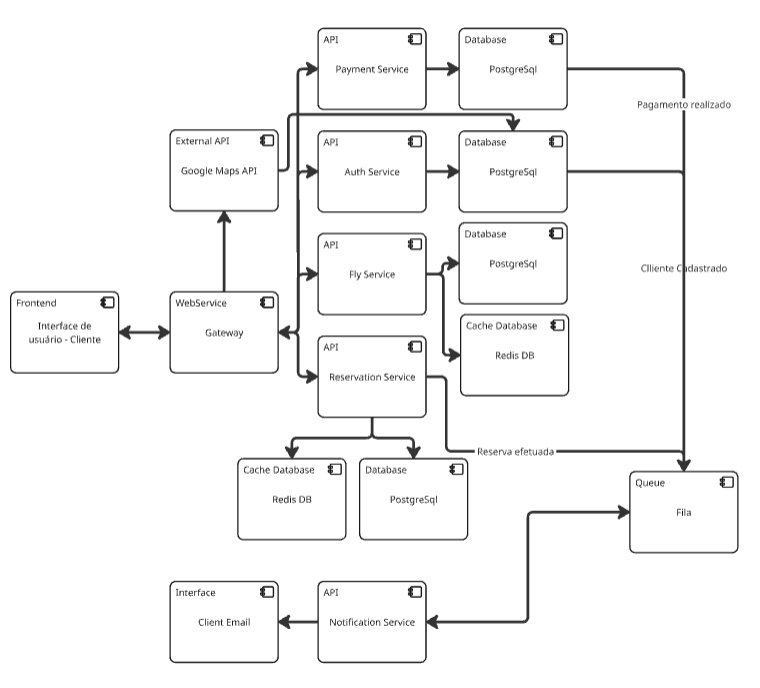
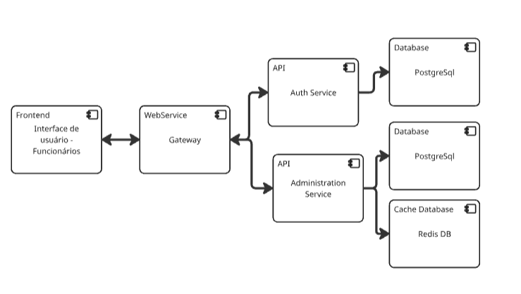

# ponderada-es6-SOA
Este repositório é destinado ao desenvolvimento da atividade ponderada de arquitetura SOA

**Enunciado:** "Problema: Sistema de Reservas de Voos com Integração de Serviços SOA Externos Sua equipe foi contratada por uma companhia aérea para desenvolver um sistema de reservas de voos altamente integrado que permitirá aos clientes pesquisar, selecionar e reservar voos. A companhia aérea opera em várias cidades e oferece uma ampla variedade de voos em diferentes horários e destinos. A companhia aérea se mostrou disposta a arcar com os custos de utilização de APIs externas que podem incorporar funcionalidades e expandir o sistema, reduzindo assim a necessidade de desenvolvimento, além de proporcionar uma melhor experiência para o usuário. Os clientes devem ser capazes de pesquisar voos com base em critérios como origem, destino, data e preferências (por exemplo, classe e número de escalas), bem como detectar automaticamente a localização do usuário. Os resultados devem incluir informações sobre os voos disponíveis, horários, preços, duração do voo e disponibilidade de assentos. Os usuários devem poder se cadastrar rapidamente no sistema, fazer suas reservas, fornecendo informações pessoais e de pagamento, e receber confirmações de reserva por e-mail. Os funcionários da companhia aérea devem ter acesso a uma interface de administração para gerenciar voos, disponibilidade de assentos e informações do cliente.

1 - Construa uma arquitetura SOA simples utilizando diagrama de componentes que leve em conta os blocos principais do sistema assim como a integração com os componentes de serviços da arquitetura SOA - Justifique os pontos da sua arquitetura

2 - Liste pelo menos 5 requisitos não funcionais deste sistema justificando a necessidade deste requisito assim como a sua relação ou necessidade dentro da arquitetura SOA"

## Decisões Arquiteturais

 

Figura X -Arquitetura da plataforma para o Cliente: 
 
 

 
 
Fonte: Material produzido pelos autor (2025)

 

 

Figura X -Arquitetura da plataforma para o Administração: 
 
 

 
 
Fonte: Material produzido pelos autor (2025)

 

### 1. Arquitetura Geral
- **Padrão Adotado**: Arquitetura orientada a serviços (SOA)
- **Motivação**: Permitir a separação clara de responsabilidades, escalabilidade independente e manutenibilidade do sistema
- **Consequências**: 
  - Maior flexibilidade para evolução dos serviços
  - Possibilidade de escalar componentes independentemente
  - Necessidade de gerenciar comunicação entre serviços

### 2. Frontend e Gateway
- **Decisão**: Separação em duas interfaces distintas (cliente e funcionários) com gateway centralizado
- **Motivação**: 
  - Separar claramente as responsabilidades de cada interface
  - Centralizar o roteamento de requisições através de um gateway
- **Benefícios**:
  - Melhor controle de acesso
  - Simplificação do gerenciamento de rotas
  - Possibilidade de aplicar políticas diferentes para cada tipo de usuário

### 3. Serviços Core
- **Serviços Implementados**:
  - Payment Service
  - Auth Service
  - Fly Service (destinado a requests relacionadas a consultas, ex.: saber a quantidade de voos no dia de hoje)
  - Reservation Service (destinado a operações relacionadas as reservas)
  - Administration Service
  - Notification Service (destinado ao envio de notificações para email dos clientes que realizarem reservas)
- **Motivação**: Separação clara de domínios e responsabilidades
- **Benefícios**:
  - Manutenção simplificada
  - Possibilidade de evolução independente
  - Melhor organização do código por domínio

### 4. Persistência de Dados
- **Decisão**: Uso de PostgreSQL como banco principal e Redis para cache
- **Motivação**:
  - PostgreSQL para dados persistentes e relacionais
  - Redis para melhorar performance com cache
- **Benefícios**:
  - Melhor performance em consultas frequentes
  - Consistência dos dados relacionais
  - Redução de carga no banco principal

### 5. Sistema de Filas
- **Decisão**: Implementação de sistema de filas para notificações
- **Motivação**: Garantir processamento assíncrono e confiável de notificações
- **Benefícios**:
  - Desacoplamento entre serviços
  - Melhor gestão de carga
  - Garantia de entrega de notificações

### 6. Padrões de Comunicação
- **Decisão**: Combinação de comunicação síncrona (REST) e assíncrona (filas)
- **Motivação**: Atender diferentes requisitos de comunicação
- **Benefícios**:
  - Resposta imediata quando necessário
  - Processamento em background para operações demoradas
  - Melhor resiliência do sistema

### 7. Cache Strategy
- **Decisão**: Implementação de cache distribuído com Redis
- **Motivação**: Melhorar performance e reduzir carga nos bancos de dados
- **Benefícios**:
  - Menor tempo de resposta
  - Redução de custos de processamento
  - Melhor experiência do usuário

---

## Minha experiência no desenvolvimento da atividade ponderada

- Para chegar na solução descrita acima segui o seguinte raciocinio:

1. Levantamento dos requisitos funcionais e não funcionais.

Nessa etapa notei que o problema não diz muito em relação aos requisitos não funcionais, logo pensei em alguns que poderiam existir:

REQUISITOS DO SISTEMA:
- Cadastro de clientes (usuários) rápido
- Os clientes devem ser capazes de pesquisar voos com base em critérios como origem, destino, data e preferências (por exemplo, classe e número de escalas), 
- Detectar automáticamente e localização do usuário
- Resposta ao cliente: voos, preços, datas, duração do voo, disponibilidade de assentos
- Cliente pode fazer reserva (info. pessoais e pagamento)
- Enviar confirmação de compra e reserva por email
- Os funcionários da companhia área devem ter acesso a uma plataforma de administração- Na interface de admin (gerenciar voos, disponibilidade de assentos e info. do cliente)

## Requisitos Não Funcionais

### 1. Segurança
- **Requisito**: O sistema deve garantir a proteção dos dados sensíveis dos usuários e transações
- **Justificativa**: Devido ao processamento de dados pessoais e informações de pagamento
- **Implementação na Arquitetura**: 
  - Auth Service dedicado para autenticação e autorização
  - Gateway centralizado para controle de acesso
  - Separação clara entre interfaces de cliente e administrativa

### 2. Disponibilidade
- **Requisito**: O sistema deve manter alta disponibilidade (uptime de 99.9%)
- **Justificativa**: Serviço crítico para negócios que opera 24/7
- **Implementação na Arquitetura**:
  - Uso de cache distribuído com Redis
  - Sistema de filas para operações assíncronas
  - Serviços independentes que podem ser escalados separadamente

### 3. Escalabilidade
- **Requisito**: O sistema deve suportar crescimento no número de usuários e transações
- **Justificativa**: Necessidade de atender picos de demanda e crescimento do negócio
- **Implementação na Arquitetura**:
  - Arquitetura distribuída com serviços independentes
  - Cache distribuído para melhorar performance
  - Separação de responsabilidades permitindo escala horizontal

### 4. Performance
- **Requisito**: Tempo de resposta máximo de 2 segundos para consultas de voos
- **Justificativa**: Garantir boa experiência do usuário
- **Implementação na Arquitetura**:
  - Cache com Redis para consultas frequentes
  - Separação entre operações síncronas e assíncronas
  - Otimização de banco de dados com PostgreSQL

### 5. Manutenibilidade
- **Requisito**: Facilidade na manutenção e evolução do sistema
- **Justificativa**: Necessidade de atualizações frequentes e correções rápidas
- **Implementação na Arquitetura**:
  - Separação clara de serviços por domínio
  - Padrões consistentes de comunicação
  - Desacoplamento entre componentes

### 6. Interoperabilidade
- **Requisito**: Integração eficiente com sistemas externos
- **Justificativa**: Necessidade de comunicação com APIs de parceiros e serviços externos
- **Implementação na Arquitetura**:
  - Gateway centralizado para gerenciamento de APIs
  - Padrões REST para comunicação
  - Sistema de filas para operações assíncronas